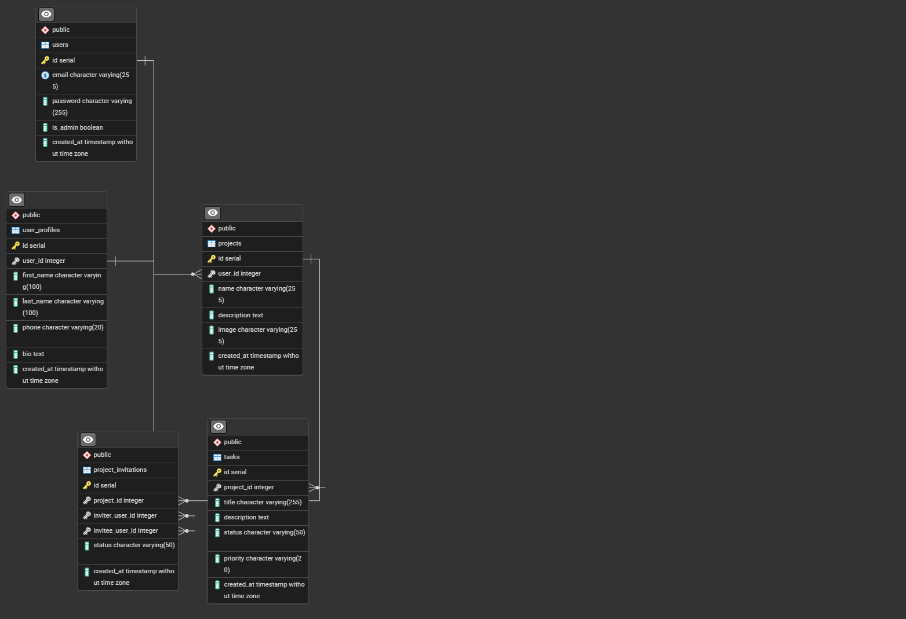
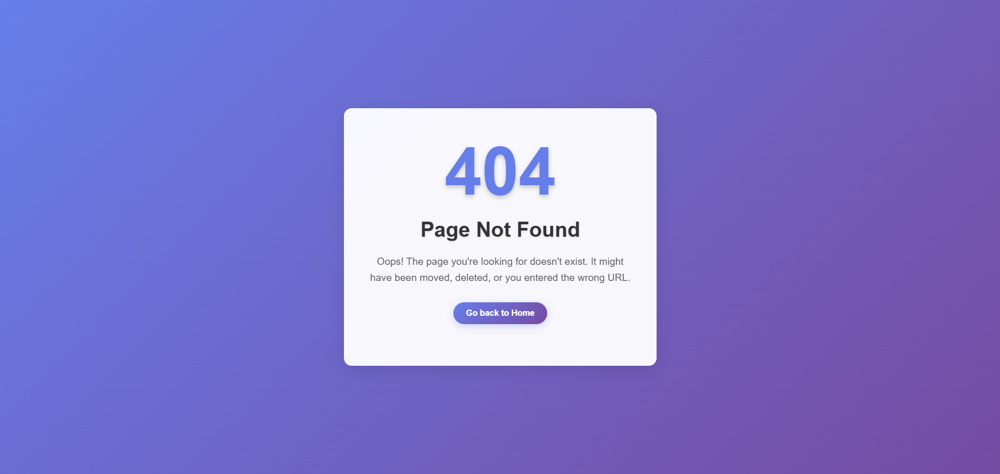
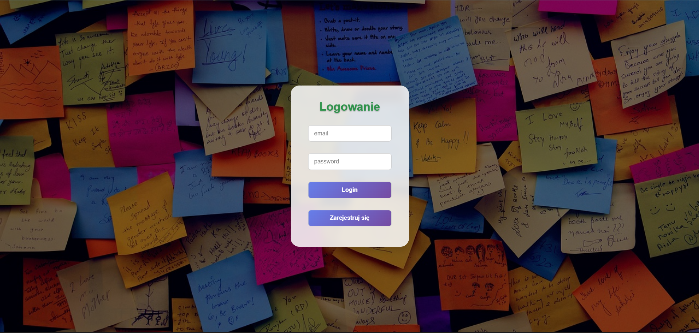
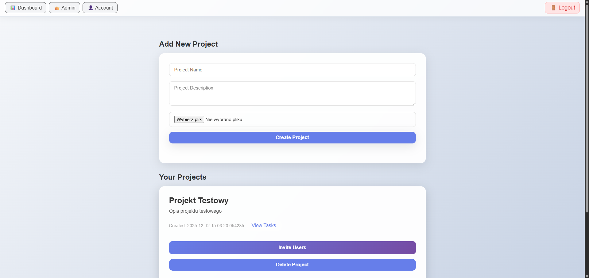
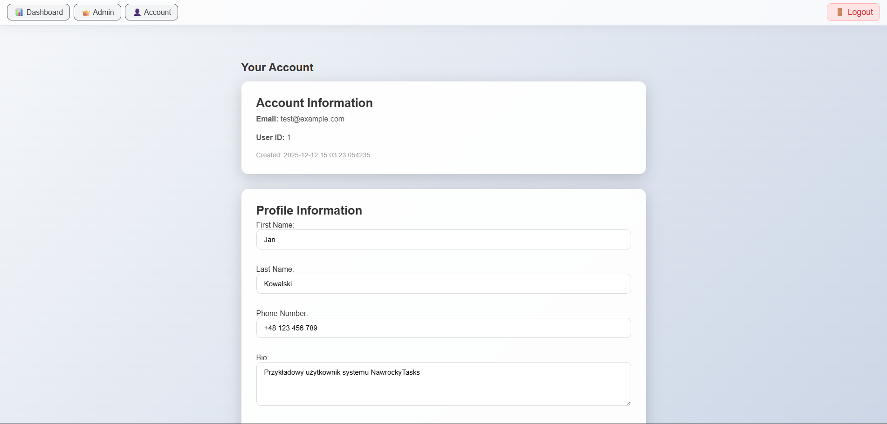
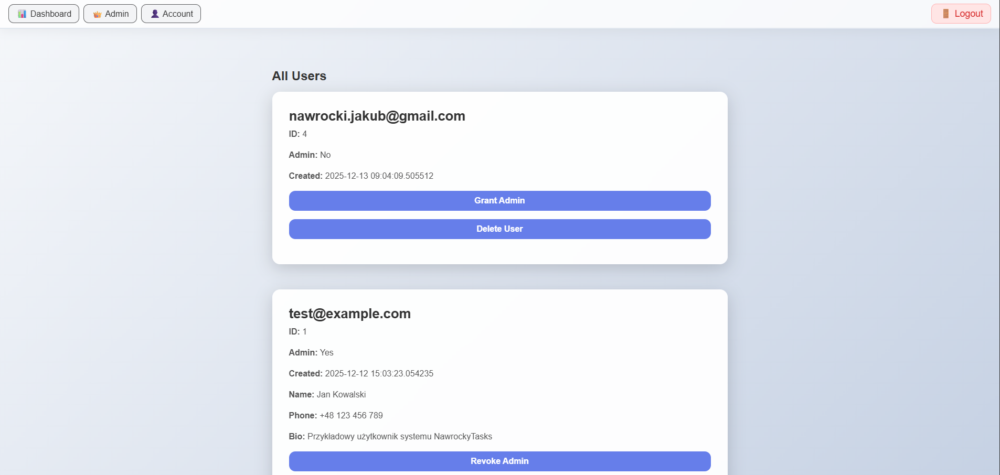

# Nawrocky Tasks

Aplikacja webowa do zarządzania zadaniami z uwierzytelnianiem użytkowników, organizacją projektów oraz funkcjami współpracy. Zbudowana z użyciem Dockera, PostgreSQL oraz nowoczesnych praktyk PHP.

## Architektura

```
┌─────────────────┐
│   Prezentacja   │  ← Widoki HTML / CSS / JS
└────────▲────────┘
         │
         ▼
┌─────────────────┐
│   Kontrolery    │  ← Logika biznesowa (bezpieczeństwo, dashboard)
└────────▲────────┘
         │
         ▼
┌─────────────────┐
│  Repozytoria    │  ← Warstwa dostępu do danych
└────────▲────────┘
         │
         ▼
┌─────────────────┐
│     Modele      │  ← Obiekty danych (User, Project, Task)
└────────▲────────┘
         │
         ▼
┌─────────────────┐
│   PostgreSQL    │  ← Warstwa bazy danych
└─────────────────┘
```

### Komponenty:
- **Frontend**: HTML, CSS, JavaScript  
- **Backend**: Kontrolery PHP  
- **Warstwa danych**: Repozytoria PHP do komunikacji z bazą danych  
- **Baza danych**: PostgreSQL  
- **Infrastruktura**: Kontenery Docker (Nginx, PHP, PostgreSQL)

---

## Instalacja

### Wymagania
- Zainstalowany Docker oraz Docker Compose  
- Git  

### Kroki instalacji
1. Sklonuj repozytorium:
   ```bash
   git clone <url>
   cd nawrockyTasks
   ```

2. Skopiuj konfigurację środowiska:
   ```bash
   cp .env.example .env
   ```

3. Skonfiguruj zmienne środowiskowe w pliku `.env`

4. Uruchom aplikację:
   ```bash
   docker compose up --build -d
   ```

5. Otwórz aplikację pod adresem `http://localhost:8080`

Aplikacja uruchomi się z przykładowymi danymi.

---

## Zmienne środowiskowe

Utwórz plik `.env` na podstawie `.env.example`:

```env
DB_HOST=db
DB_PORT=5432
DB_NAME=nawrocky_tasks
DB_USER=nawrocky
DB_PASSWORD=nawrocky

APP_URL=http://localhost:8080

ADMIN_EMAIL=admin@example.com
ADMIN_PASSWORD=admin
```

---

## Scenariusz testowy

Poniższe kroki pozwalają przetestować podstawowe funkcjonalności aplikacji.

---

## Scenariusz A: Zwykły użytkownik

### 1. Rejestracja
- Przejdź do `http://localhost:8080/register`
- Wyślij formularz rejestracji

### 2. Logowanie
- Przejdź do `http://localhost:8080`
- Zaloguj się przy użyciu zarejestrowanego konta

### 3. Kontrola dostępu
- Spróbuj wejść na `/admin-users`
- Sprawdź, czy wyświetla się strona **403 Forbidden**
- Wyloguj się i spróbuj wejść na `/dashboard`

### 4. Operacje CRUD – Projekty
- Z poziomu dashboardu kliknij **Create Project**
- Wyślij formularz
- Sprawdź, czy projekt pojawił się na liście
- Otwórz szczegóły projektu
- Usuń projekt

### 5. Operacje CRUD – Zadania
- W widoku projektu kliknij **Add Task**
- Wyślij formularz
- Sprawdź, czy zadanie pojawiło się na liście
- Zmień status zadania:
  - pending → completed
- Usuń zadanie

### 6. Zaproszenia do projektu (wysyłanie)
- Jako właściciel projektu zaproś innego użytkownika
- Podaj adres e-mail istniejącego użytkownika
- Wyślij zaproszenie
- Wyloguj się

### 7. Zaproszenia do projektu (odbieranie)
- Zaloguj się jako zaproszony użytkownik
- Przejdź do sekcji zaproszeń
- Zaakceptuj lub odrzuć zaproszenie

---

## Scenariusz B: Administrator

### 8. Logowanie administratora
- Przejdź do `http://localhost:8080`
- Zaloguj się jako administrator:
  - Email: `admin@example.com`
  - Hasło: `admin`

### 9. Panel administratora
- Przejdź do `/admin-users`

### 10. Zarządzanie użytkownikami
- Zmień rolę wybranego użytkownika (admin / user)
- Zapisz zmiany
- Wyloguj się
- Zaloguj się jako zmodyfikowany użytkownik

### 11. Błędy uwierzytelniania
- Spróbuj wejść na chronione trasy bez logowania
- Zaloguj się jako zwykły użytkownik i spróbuj wejść na `/admin-users`

---

## Schemat bazy danych

Aplikacja korzysta z PostgreSQL i zawiera następujące tabele:
- `users` – konta użytkowników i role  
- `projects` – projekty wraz z właścicielami  
- `tasks` – zadania przypisane do projektów  
- `project_invitations` – system zaproszeń do projektów  
- `user_profiles` – rozszerzone informacje o użytkownikach  

---

## Wykorzystane technologie

- **Backend**: PHP  
- **Baza danych**: PostgreSQL  
- **Frontend**: HTML, CSS, JavaScript  
- **Infrastruktura**: Docker, Nginx  
- **Bezpieczeństwo**: haszowanie haseł, sesje, kontrola dostępu oparta na rolach

## Zrzuty






